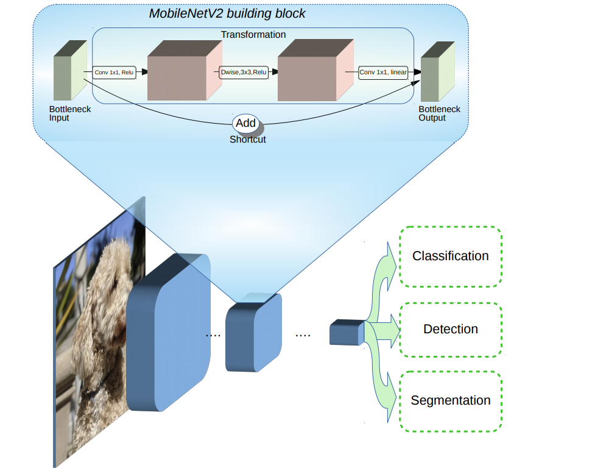
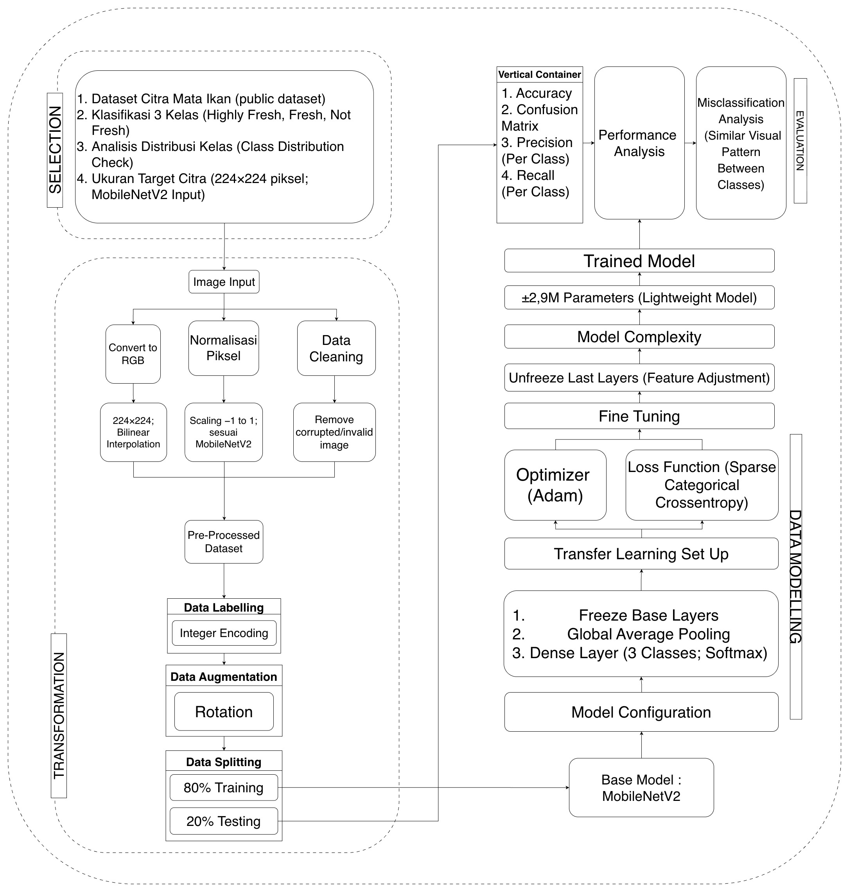
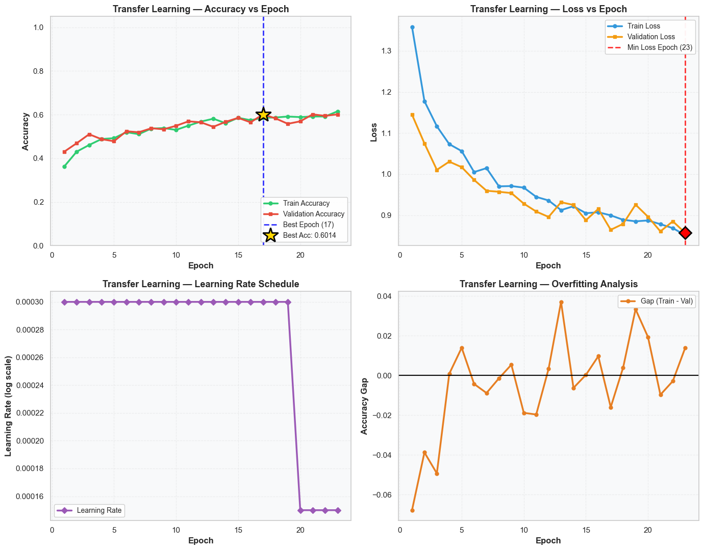
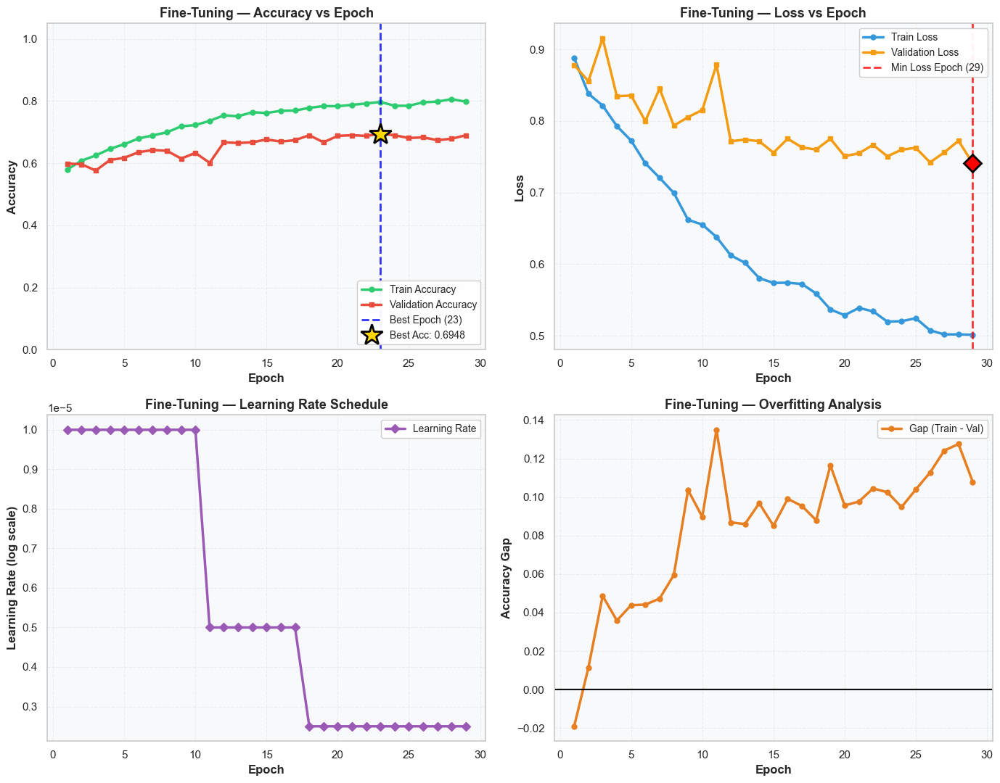
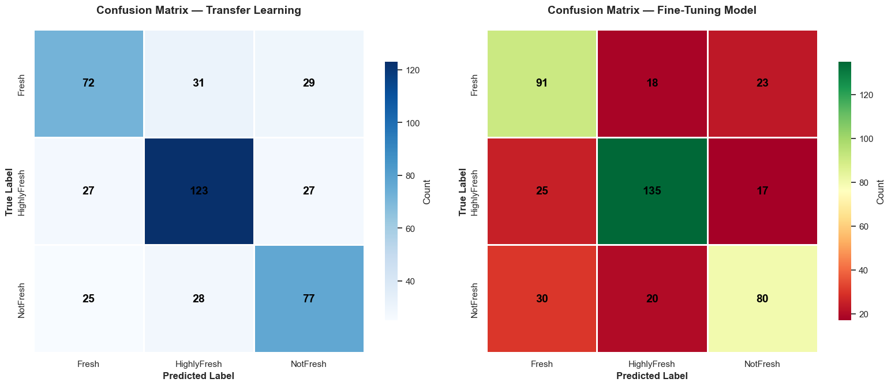
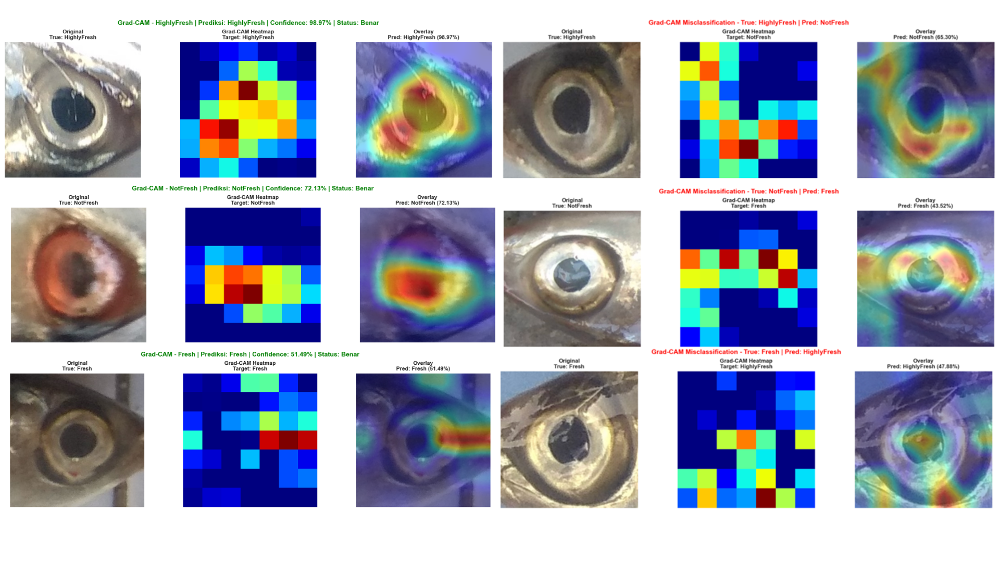

# Optimasi MobileNetV2 Menggunakan Strategi Fine-Tuning untuk Klasifikasi Kesegaran Ikan Berbasis Citra Digital


## 👨‍🎓 Author

**Justin Stephen**  
NIM: 00000072126  
Program Studi Sistem Informasi  
Universitas Multimedia Nusantara

---

## 📖 Overview

Fish freshness assessment is commonly performed through manual visual inspection, which may lead to subjective and inconsistent evaluations. This research proposes a fish freshness classification system based on fish eye images using MobileNetV2 combined with Transfer Learning and Fine-Tuning strategies.

The proposed approach aims to improve classification performance while maintaining computational efficiency. Experimental results demonstrate that Fine-Tuning successfully improves model performance on the Freshness of Fish Eyes (FFE) dataset.

---

## 🚀 Research Highlights

- Fish freshness classification using fish eye images.
- MobileNetV2 with Transfer Learning and Fine-Tuning.
- Validation accuracy improved from 60.14% to 69.48%.
- Lightweight model with only 2.59 million parameters.
- Grad-CAM used for model interpretability.

---

## 📄 Documentation

The repository includes the following documents:

| Document | Description |
|-----------|-------------|
| article_journal.pdf | Research article version |
| thesis_report.pdf | Final thesis report |

Files are available in the `docs/` directory.

---

## 🎯 Research Objectives

- Develop a fish freshness classification model based on digital images.
- Implement MobileNetV2 using Transfer Learning.
- Optimize model performance through Fine-Tuning.
- Evaluate classification performance using multiple evaluation metrics.

---

## 📂 Dataset

### Freshness of Fish Eyes (FFE) Dataset

Dataset Source:  
https://data.mendeley.com/datasets/xzyx7pbr3w/1

### Classes

- Highly Fresh
- Fresh
- Not Fresh

### Dataset Information

| Description | Value |
|------------|---------|
| Original Images | 4,414 |
| Images After Cleaning | 4,404 |
| Number of Classes | 3 |

---

## 🔬 Research Methodology

This research follows the Knowledge Discovery in Databases (KDD) framework:

1. Data Selection
2. Data Preprocessing
3. Data Transformation
4. Model Development
5. Evaluation

## 🧠 Model Architecture



## 🔄 Research Workflow



### Preprocessing

- Image resizing (224 × 224)
- Pixel normalization
- Data augmentation
  - Rotation
  - Zoom
  - Horizontal Flip

### Data Splitting

- Training Data : 80%
- Testing Data : 20%

---

## 🧠 Proposed Model

### Architecture

- MobileNetV2
- Transfer Learning
- Fine-Tuning
- Softmax Classifier

### Training Configuration

| Parameter | Value |
|------------|---------|
| Input Size | 224 × 224 |
| Optimizer | Adam |
| Batch Size | 32 |
| Transfer Learning Learning Rate | 0.0003 |
| Fine-Tuning Learning Rate | 0.00001 |
| Output Classes | 3 |

---

## 📊 Experimental Results

### Model Performance

| Metric | Transfer Learning | Fine-Tuning |
|----------|----------|----------|
| Validation Accuracy | 60.14% | 69.48% |
| Validation Loss | 0.86 | 0.75 |

### Final Evaluation Results

| Metric | Score |
|----------|----------|
| Accuracy | 69.70% |
| Precision | 69.01% |
| Recall | 68.92% |
| F1-Score | 68.87% |

### Key Findings

- Fine-Tuning improved validation accuracy from **60.14%** to **69.48%**.
- MobileNetV2 achieved competitive performance with only **2.59 million parameters**.
- The model successfully classified fish freshness into three categories.
- Grad-CAM visualization showed that the model focused on relevant fish-eye regions during prediction.

---

## 📈 Performance Visualization

### Transfer Learning



### Fine-Tuning



### Confusion Matrix



## 🔍 Confusion Matrix Analysis

The model achieved the best performance on the Highly Fresh class. Most misclassifications occurred between Fresh and Highly Fresh categories due to similar visual characteristics of fish eyes.

### Grad-CAM Visualization



## 🎯 Grad-CAM Interpretation

Grad-CAM visualization indicates that the model focuses primarily on the pupil, cornea, and reflective regions of the fish eye when performing freshness classification. This suggests that the model learns relevant visual features rather than relying on background information.

---

## 📊 Comparison with Previous Research

| Model | Parameters (Million) | Accuracy (%) |
|---------|---------|---------|
| MobileNetV1 MB-BE | 3.16 | 63.21 |
| Proposed MobileNetV2 | 2.59 | 69.48 |

The proposed MobileNetV2 model achieved higher classification performance while using fewer parameters compared to the previous MobileNetV1 MB-BE approach.

---

## 📌 Research Contributions

1. Implementation of MobileNetV2 for fish freshness classification.
2. Optimization through Transfer Learning and Fine-Tuning.
3. Comparative evaluation against previous MobileNetV1 MB-BE research.
4. Integration of Grad-CAM for model explainability.

---

## 📁 Repository Structure

```text
.
├── docs/
│   ├── article_journal.pdf
│   └── thesis_report.pdf
│
├── model/
│   └── mobilenetv2_model.py
│
├── notebook/
│   └── skripsi_final.ipynb
│
├── results/
│   ├── transfer_learning.png
│   ├── fine_tuning.png
│   ├── confusion_matrix.png
│   └── grad_cam.png
│
├── README.md
├── requirements.txt
└── LICENSE
```

---

## 💻 Requirements

```bash
tensorflow
keras
numpy
pandas
matplotlib
scikit-learn
opencv-python
```

Install dependencies:

```bash
pip install -r requirements.txt
```
---

## 📚 Citation

Stephen, J. (2026). *Optimasi MobileNetV2 Menggunakan Strategi Fine-Tuning untuk Klasifikasi Kesegaran Ikan Berbasis Citra Digital*. Undergraduate Thesis, Universitas Multimedia Nusantara.


